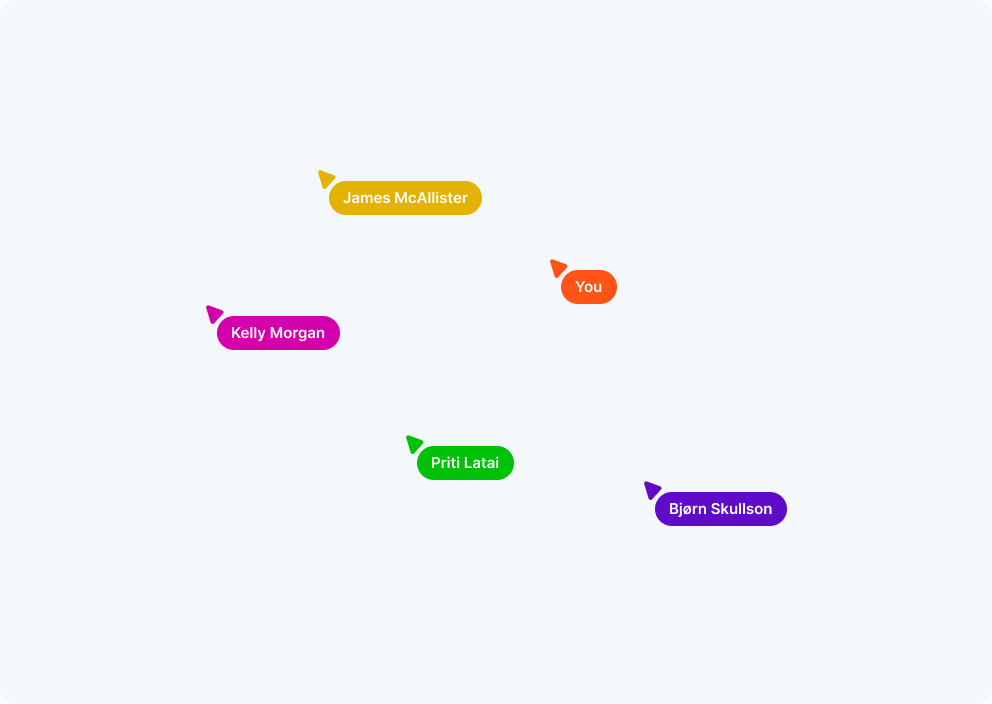

## Overview

This folder contains the code for the Live cursors - a demo of how you can leverage [Ably Spaces](https://github.com/ably/spaces) to show names of other members in a space along with their current cursor location.

